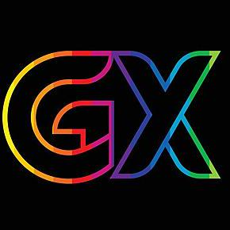

# 🚀 **GamerX Linux**

  

---

## 🎮 **What is GamerX Linux?**

**GamerX Linux** is a modern, lightning-fast, and ultra-lightweight Linux distribution designed for gamers, creators, hackers, and power users. Built on Arch Linux, it combines bleeding-edge performance, beautiful customizations, and a fully automated setup experience.

---

## ✨ **Key Features**

- **⚡ Blazing Fast & Lightweight**  
  Minimal resource usage, super-fast boot & shutdown, and optimized for both old and new hardware.

- **🖥️ Hyprland Desktop with Custom Themes**  
  Gorgeous, deeply customized Hyprland setup with exclusive GX themes and dynamic layouts.

- **🚀 Automated Custom Installer**  
  The all-new **GamerX Installer** automates the entire setup process: disk, user, packages, profiles, and more. No more manual Arch pain!

- **🛠️ Useful Preinstalled Applications**  
  Includes everything you need: browsers, editors, gaming tools, media, development, and system utilities.

- **🔄 Rolling Updates**  
  Always up-to-date with the latest packages and security fixes.

- **🔧 Custom GX Settings App**  
  Control system tweaks, kernel-level optimizations, and desktop customizations from a single, modern UI.

- **🐧 Custom GX Kernel Integration**  
  Enhanced performance, security, and hardware support with special GX Kernel patches.

- **🎨 Custom Themes & Personalization**  
  Beautiful wallpapers, icon packs, cursor themes, and a dark/bright global aesthetic.

- **🔒 Security & Privacy**  
  Hardened defaults, privacy tools, and optional built-in VPN support.

---

## 🆕 **Coming Soon: GX Applications**

- **📦 GX PKG Installer**  
  Install `.deb`, `.rpm`, `.AppImage`, and more—directly from the desktop! Universal GNU/Linux package support.

- **🌐 GX Browser**  
  Powerful, secure, and customizable browser with built-in VPN, adblock, privacy features, and deep theme integration.

- **🛡️ GX Security Tools**  
  One-click hardening, firewall, sandboxing, and more.

- **🧰 GX Utilities & Scripts**  
  Handy scripts and tools for gamers, hackers, and developers.

---

## 📦 **Included Applications & Tools**

- Hyprland, Waybar, Wofi, Kitty, Swaylock, SDDM, Pipewire, Wireplumber
- Steam, Lutris, Wine, Gamemode, MangoHud
- GIMP, Inkscape, VLC, MPV, and more
- Git, Python, Vim, Nano, and developer essentials
- ...and many more!

---

## 🛠️ **Custom Installer Highlights**

- Fully TUI-based, beautiful and interactive
- Disk and partitioning wizard (auto/manual)
- Profile selection: Gaming, Hacking, Hybrid
- User, locale, timezone, and kernel selection
- Automated post-install tweaks and optimizations
- Detailed logging and error reporting

---

## 👨‍💻 **Developer & Contact Info**

- **GitHub:** [GamerXECO-sys55](https://github.com/GamerXECO-sys55)
- **Email:** mangeshchoudhary35@gmail.com
- **Lead Developer:** Mangesh Choudhary

---

## 📝 **License & Contributions**

GamerX Linux is open source. Contributions, bug reports, and suggestions are welcome!

---

## 🌈 **Screenshots & Demo**

> _Coming soon!_

---

## 💡 **Why GamerX Linux?**

Because you deserve a distro that just works—fast, beautiful, powerful, and fully yours.

---

<b><i>Ready to level up your Linux experience?</i></b>

<b>✨ Get started with GamerX Linux today! ✨</b>

